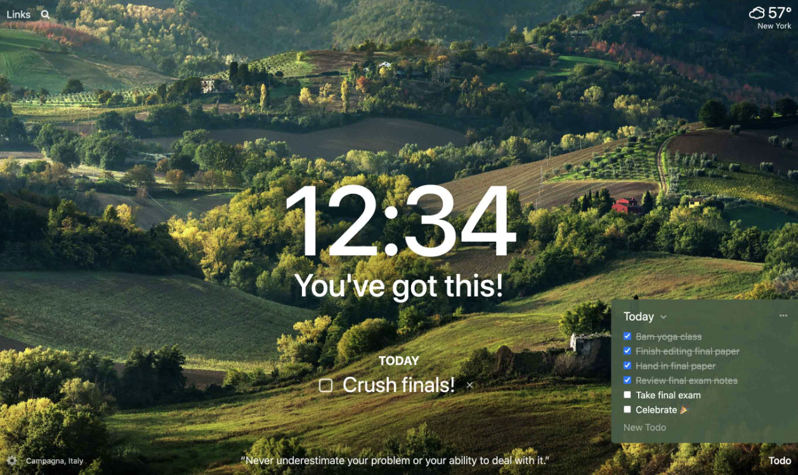

# Momentum Clone Coding 🚀

이 프로젝트는 인기 있는 Chrome 확장 프로그램 **Momentum**을 클론코딩하며, HTML, CSS, 그리고 JavaScript의 기초부터 심화까지 학습하는 데 목적을 둡니다.

---

## 📚 프로젝트 소개
Momentum은 시간, 날씨, 할 일 리스트, 동기부여 문구 등을 표시하는 **퍼스널 대시보드**입니다. 이 클론 프로젝트를 통해 다음과 같은 기술을 학습하고 익힙니다:
- **HTML**로 구조를 설계하고,
- **CSS**로 디자인과 레이아웃을 구현하며,
- **JavaScript**로 동적인 기능을 추가.

---
## 📂 폴더 구조
```plaintext
momentum/
├── index.html          # 메인 HTML 파일
├── css/                # 프로젝트 전반의 스타일 정의
│   ├── style.css       
├── js/                 # 주요 JavaScript 기능 구현
│   ├── background.js
│   ├── clock.js
│   ├── greetings.js
│   ├── quotes.js  
│   ├── todo.js
│   ├── weather.js
├── img/                # 이미지, 아이콘, 폰트 등 리소스 파일
│   ├── backgrounds.jpg # 배경 이미지들
└── README.md           # 프로젝트 설명 파일 (바로 이 파일)
```
---

## 🛠️ 주요 기능
Momentum 클론 프로젝트는 다음과 같은 주요 기능을 구현합니다:
1. **시간 표시**:
   - JavaScript를 이용해 현재 시간을 실시간으로 업데이트.
2. **할 일 리스트**:
   - 사용자가 추가하고 삭제할 수 있는 간단한 To-Do 리스트.
3. **배경 이미지와 동기부여 문구**:
   - JavaScript를 이용해 랜덤 배경 이미지와 명언 표시.
4. **날씨 정보 표시**:
   - OpenWeather API를 활용해 실시간 날씨 정보를 보여줌.

---

## 🌱 학습 목표


---

## 📝 학습 기록
### 2024-11-26


---

## 📌 추가로 구현할 기능
- [ ] 사용자 이름 입력 후 저장.
- [ ] 배경 이미지 교체 버튼 추가.
- [ ] 완료된 할 일 리스트 숨김 처리.

---